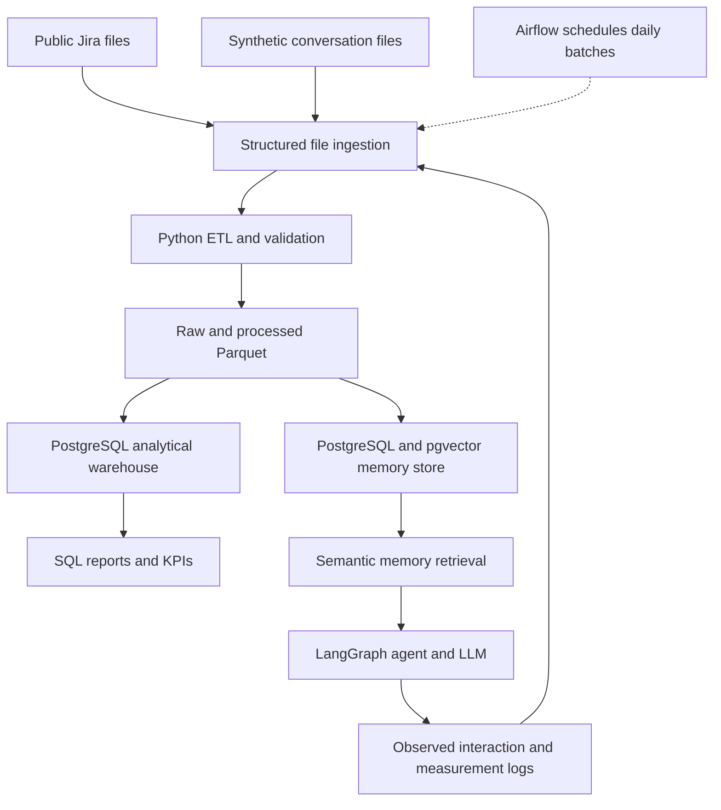

# Data Engineering for Long Term AI Agent Memory Management

University of Tartu, Data Engineering, Project 1: Data Architecture and Modeling.

Repository: https://github.com/muhammadzain727/agent-memory-pipeline

## Project status

This repository documents the proposed architecture and analytical model for
an AI Project Operations Agent. Project 1 requires a design, rather than a
working ingestion pipeline or deployed agent. The SQL files illustrate the
planned warehouse and the questions it should answer.

The full editable Word document is a working draft. Before submission, prepare
the final `Report.pdf` with **no more than three pages**, member roles and actual
contribution percentages, and links to all AI chats used. Supporting repository
files are outside the PDF page limit.

## Objective and use case

Design a data architecture that manages growing AI agent memory and retrieves
relevant historical information while reducing unnecessary LLM context.

The agent uses Jira project history and previous interactions to answer
questions about issues, decisions and changes. AI developers, data engineers
and project teams use the analysis to compare memory strategies.

## Datasets

| Dataset | Source and role | Planned qualifying extract |
|---|---|---|
| Public Jira Dataset v7 | Historical issue, comment and change records from https://zenodo.org/records/15719919 | At least 1,000 eligible records and at least eight native attributes, with source keys retained |
| Agent Conversation Dataset | Synthetic conversations grounded in selected Jira issue histories | Approximately 5,000 interaction records; at least 1,000 retained rows and at least eight attributes |

Zenodo reports 16 repositories, 1,822 projects, approximately 2.7 million issues,
32 million changes, 9 million comments and 1 million issue links. The release
archive is approximately 5.8 GB. These are publisher statistics for the full
release, not counts measured from our selected subset.

Planned Jira attributes include issue ID/key, project, summary, description,
issue type, status, priority, created and updated timestamps. Keep raw comments
and changelog records where available. Namespace identifiers by source repository.

The planned synthetic records contain interaction ID, timestamp, user ID,
project ID, issue ID, user question, agent response, memory strategy,
full-history tokens, selected-context tokens, input tokens, retrieved-memory
count, retrieval latency and response latency. Raw text remains in the source
and memory stores; the warehouse holds analytical attributes and measures.

**Dataset status:** the qualifying subsets and 5,000-interaction dataset remain
planned. The small fabricated SQL examples in this repository are not those
datasets, and are not measured agent results. Unknown measurements remain NULL
until observed. Publish actual row counts, column lists, missingness and hashes
after extraction/generation.

The synthetic generation plan is informed by Maharana et al. (ACL 2024), which
grounds generated conversations in events and uses human verification. We
adapt that principle to Jira histories; we do not claim to reproduce LoCoMo.
See [source and generation notes](docs/source_and_generation_notes.md).

## KPIs and analytical questions

1. **Context reduction (%)** = 100 × (full-history tokens − selected-context
   tokens) / full-history tokens. A zero baseline yields NULL.
2. **Input token consumption:** observed tokens in the complete prompt sent
   to the LLM, including the question and fixed prompt overhead.
3. **Retrieval latency:** measured milliseconds spent retrieving historical memory.

The warehouse answers:

1. How much is context reduced compared with complete eligible history?
2. How does input token use differ by memory strategy?
3. How does retrieval latency differ by strategy?
4. Which projects generate the most agent interactions and historical Jira events?
5. How many historical memories are retrieved per interaction and strategy?

## Architecture and tools



| Stage | Planned tool |
|---|---|
| File acquisition and ingestion | MongoDB Database Tools for the original dump; Python for selected exports and generated files |
| Cleaning and transformation | Python and Pandas |
| Raw and processed storage | Parquet files with immutable source manifests |
| Analytical warehouse | PostgreSQL |
| Batch scheduling | Apache Airflow |
| Quality checks | Python and SQL |
| Memory storage and similarity search | PostgreSQL, pgvector and Sentence Transformers |
| Agent workflow | LangGraph |
| Reporting | PostgreSQL SQL queries |

The published Jira release is frozen. Daily ingestion replays historical
records in controlled batches; it does not represent newly collected live Jira
updates. Generated conversations and later measured interaction logs can be
batched daily. Loads use stable keys to avoid duplicates on retries.

## Dimensional model

The model consists of two related stars with shared dimensions:

- `FactAgentInteraction`: one recorded user-agent interaction using one memory
  strategy. Separate strategy executions receive separate interaction IDs.
- `FactIssueEvent`: one recorded historical Jira issue event or change.

| Dimension | Used by | SCD policy and reason |
|---|---|---|
| `DimDate` | Both facts | Static calendar attributes |
| `DimUser` | Both facts | Type 1, retaining current descriptive attributes |
| `DimProject` | Both facts | Type 2, retaining observed project attribute versions |
| `DimIssue` | Both facts | Type 1; historical changes remain in the event fact |
| `DimEventType` | Issue events | Static controlled event classifications |
| `DimMemoryStrategy` | Agent interactions | Static categories within a frozen experiment |

Memory strategies are **Complete History**, **Recent Context + Retrieval** and
**Retrieval + Compression**. Freeze the source snapshot, model, tokenizer,
generation settings and prompt, and compare the same cases across strategies.
Store the paired case ID and configuration manifest in raw logs. Load one
versioned experiment per analytical snapshot so SQL does not mix changed settings.

Project Type 2 intervals use `[effective_from, effective_to)`. ETL assigns the
surrogate project key valid on each record's date. Intervals must not overlap,
and one current version is allowed per stable project ID. If historical project
metadata is unavailable, retain one observed version rather than inventing changes.
Use separate namespaces for anonymous Jira actors and synthetic users; do not
infer that they are the same person.

## Metric and quality rules

Full-history and selected-context token counts use the same tokenizer and refer
to eligible historical memory before the current question. Input-token count
includes the full actual prompt. The full-history baseline must be within the
declared model limit; label or exclude over-limit cases consistently.

Measure latency during real execution, including any compression time in
end-to-end response reporting. The illustrative quality score uses a declared
0–100 scale and remains NULL until evaluated. Context reduction alone does not
establish answer quality. Do not generate random latency or quality values and
present them as measured performance.

Check required keys, source uniqueness, valid UTC timestamps, foreign keys,
nonnegative measures and selected-context tokens no greater than eligible full
history. Preserve missing optional source values, quarantine invalid records,
and validate Type 2 assignments. Show measurement coverage alongside averages.

## Repository files

- `README.md`: project overview and reproducibility notes.
- `sql/01_schema.sql`: DDL defining tables, keys, relationships and constraints.
- `sql/02_sample_data.sql`: DML inserting clearly fabricated demonstration rows.
- `sql/03_demo_queries.sql`: five queries answering the business questions.
- `sql/04_quality_checks.sql`: additional consistency checks.
- `docs/data_dictionary.md`: types and meanings of all 46 warehouse columns.
- `docs/source_and_generation_notes.md`: source status and research grounding.
- `docs/architecture.png`, `docs/star_schema.png`: diagrams for the document.
- `docs/architecture.svg`, `docs/star_schema.svg`: editable vector versions.
- `tools/validate_examples.py`: optional synthetic SQL checks using Python's standard library.

Add the final three-page `Report.pdf` to this repository after editing.

## SQL examples

For an empty local PostgreSQL test database, the example sequence is:

```bash
psql -d agent_memory_demo -f sql/01_schema.sql
psql -d agent_memory_demo -f sql/02_sample_data.sql
psql -d agent_memory_demo -f sql/03_demo_queries.sql
psql -d agent_memory_demo -f sql/04_quality_checks.sql
```

These are illustrative model files, not a deployed pipeline. Optional local
arithmetic checks can be run with `python tools/validate_examples.py`; those
use SQLite and adapt its date-cast syntax, not a PostgreSQL deployment.

Query 4 independently aggregates the two fact tables before combining counts.
It includes historical events as well as interactions and groups all project
versions by stable identity. Joining raw facts directly would multiply counts.

## Team and AI disclosure

| Member | Proposed responsibility | Actual contribution |
|---|---|---|
| [ADD NAME 1] | Data engineering | [ADD %] |
| [ADD NAME 2] | Memory and retrieval | [ADD %] |
| [ADD NAME 3] | AI agent and evaluation | [ADD %] |

Replace placeholders with agreed percentages totaling 100%.

Generative AI assisted with project planning, language refinement, document
preparation, README drafting and supporting SQL examples. The team must review
and understand submitted material.

AI conversation link(s): **[ADD SHARED LINKS TO EVERY AI CHAT USED]**.

## References

1. Montgomery, L., Lüders, C., and Maalej, W. (2022). *An Alternative Issue Tracking Dataset of Public Jira Repositories*. MSR 2022. Dataset v7: https://zenodo.org/records/15719919. DOI: 10.5281/zenodo.15719919.
2. Maharana et al. (2024). *Evaluating Very Long-Term Conversational Memory of LLM Agents*. ACL 2024. https://aclanthology.org/2024.acl-long.747/. DOI: 10.18653/v1/2024.acl-long.747.
