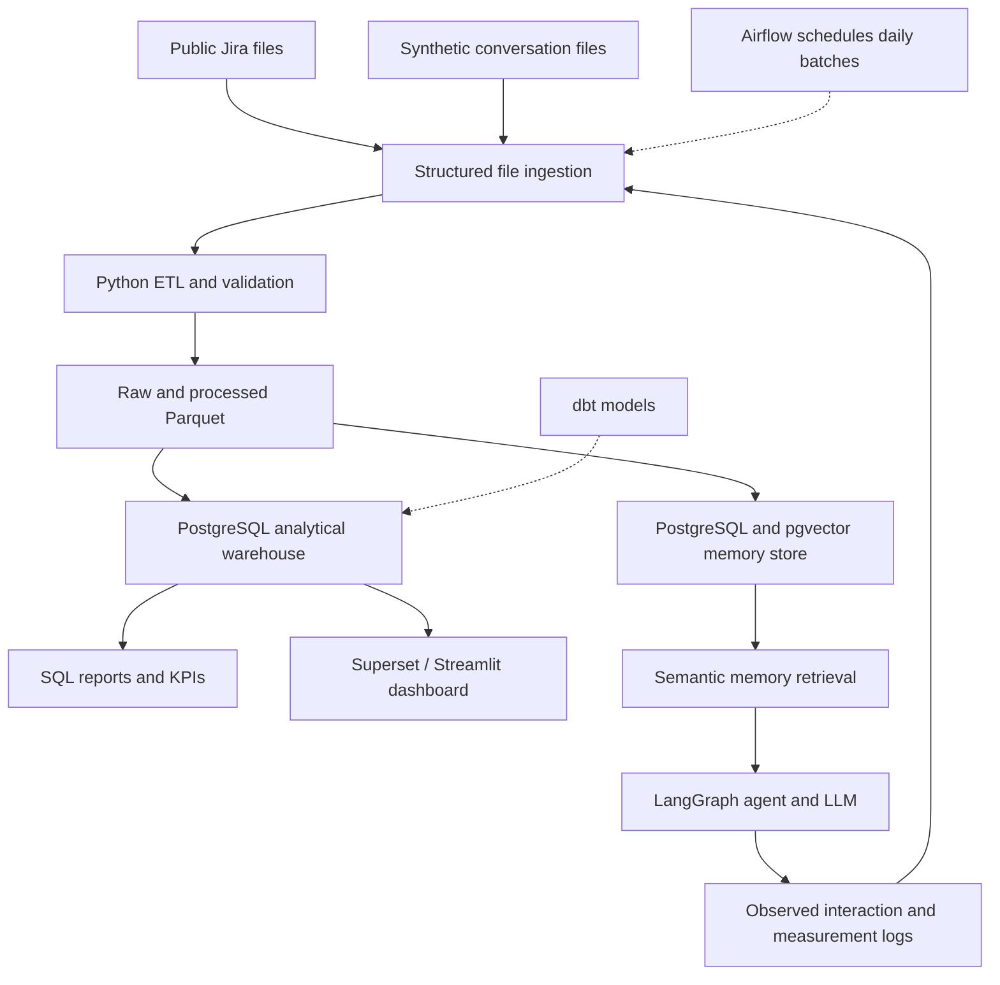

# Data Engineering for Long Term AI Agent Memory Management

University of Tartu, Data Engineering, Project 1: Data Architecture and Modeling.

Repository: https://github.com/muhammadzain727/agent-memory-pipeline

## Project Overview

Design a data architecture that manages growing AI agent memory and retrieves
relevant historical information while reducing unnecessary LLM context.

The agent uses Jira project history and previous interactions to answer
questions about issues, decisions and changes. AI developers, data engineers
and project teams use the analysis to compare memory strategies.

## Project Status

Project 1 requires a design rather than a working ingestion pipeline or
deployed agent. This repository documents the proposed architecture and
analytical model. The SQL files illustrate the planned warehouse schema and
the questions it should answer. See `Report.pdf` for the submitted project
document.

## Team Members and Contributions

| Member | Role | Contribution |
|---|---|---|
| Muhammad Zain | Data model design, AI Agent memory architecture, dimensional schema, SCD justification, demo SQL queries, report preparation | 40% |
| Hashim Ali | Dataset research and preparation, data engineering tooling plan, data dictionary, demo SQL queries, report preparation | 40% |
| Karl Ingmar Adamson | Dataset preparation support, data dictionary support, SQL query support, report review | 20% |

## LLM Disclosure

AI tools (Claude, ChatGPT) were used during this project for brainstorming,
schema design review, report structuring, and proofreading. All architectural
decisions, design choices, and written content were reviewed and verified by
the team.

Conversation links:
- ChatGPT: [Conversation link](https://chatgpt.com/share/6ac7e607-7bf0-83ed-8cde-8acce7a61589)

## Datasets

| Dataset | Source and role | Planned qualifying extract |
|---|---|---|
| Public Jira Dataset v7 | Historical issue, comment and change records from https://zenodo.org/records/15719919 | At least 1,000 eligible records and at least eight native attributes, with source keys retained |
| Agent Conversation Dataset | Synthetic conversations grounded in selected Jira issue histories, informed by Maharana et al. (ACL 2024) | Approximately 5,000 interaction records; at least 1,000 retained rows and at least eight attributes |

Zenodo reports 16 repositories, 1,822 projects, approximately 2.7 million issues,
32 million changes, 9 million comments and 1 million issue links. The release
archive is approximately 5.8 GB. These are publisher statistics for the full
release, not counts measured from our selected subset.

Planned Jira attributes include issue ID/key, project, summary, description,
issue type, status, priority, created and updated timestamps. Raw comments and
changelog records are retained where available. Namespace identifiers by source
repository.

The planned synthetic records contain interaction ID, timestamp, user ID,
project ID, issue ID, user question, agent response, memory strategy,
full-history tokens, selected-context tokens, input tokens, retrieved-memory
count, retrieval latency and response latency. Raw text remains in the source
and memory stores; the warehouse holds analytical attributes and measures.

**Dataset status:** the qualifying subsets and 5,000-interaction dataset remain
planned. The small fabricated SQL examples in this repository are not those
datasets, and are not measured agent results. Unknown measurements remain NULL
until observed. Publish actual row counts, column lists, missingness and hashes
after extraction and generation.

The synthetic generation plan is informed by Maharana et al. (ACL 2024), which
grounds generated conversations in events and uses human verification. We
adapt that principle to Jira histories; we do not claim to reproduce LoCoMo.

## KPIs and Analytical Questions

1. **Context reduction (%)** = 100 × (full-history tokens − selected-context
   tokens) / full-history tokens. A zero baseline yields NULL.
2. **Input token consumption:** observed tokens in the complete prompt sent
   to the LLM, including the question and fixed prompt overhead.
3. **Retrieval latency:** measured milliseconds spent retrieving historical memory.

The warehouse answers:

1. How much is context reduced compared with complete eligible history?
2. How does input token use differ by memory strategy?
3. How does retrieval latency differ by strategy?
4. Which projects generate the most agent interactions and historical Jira events?
5. How many historical memories are retrieved per interaction and strategy?

## Architecture and Tools

| Stage | Planned Tool |
|---|---|
| Source file extraction | Python / JSON parsing for Jira source files |
| Cleaning and transformation | Python and Pandas |
| Data transformation models | dbt |
| Raw and processed storage | Parquet files with immutable source manifests |
| Analytical warehouse | PostgreSQL |
| Batch scheduling | Apache Airflow |
| Quality checks | Python and SQL |
| Memory storage and similarity search | PostgreSQL, pgvector and Sentence Transformers |
| Agent workflow | LangGraph |
| Reporting and visualization | Apache Superset / Streamlit |

The published Jira release is frozen. Daily ingestion replays historical
records in controlled batches; it does not represent newly collected live Jira
updates. Generated conversations and later measured interaction logs can be
batched daily. Loads use stable keys to avoid duplicates on retries.

## Dimensional Model

The model consists of two related stars with shared dimensions:

- `FactAgentInteraction`: one recorded user-agent interaction using one memory
  strategy. Separate strategy executions receive separate interaction IDs.
- `FactIssueEvent`: one recorded historical Jira issue event or change.

| Dimension | Used by | SCD Policy and Reason |
|---|---|---|
| `DimDate` | Both facts | Static — calendar attributes never change |
| `DimUser` | Both facts | Type 1 — current descriptive attributes are sufficient for this analysis |
| `DimProject` | Both facts | Type 2 — project attribute versions are preserved for historical accuracy |
| `DimIssue` | Both facts | Type 1 — historical changes are captured in FactIssueEvent, no Type 2 needed |
| `DimEventType` | Issue events | Static — controlled event classifications are fixed |
| `DimMemoryStrategy` | Agent interactions | Static — strategy categories are frozen within the experiment |

Memory strategies evaluated: **Complete History**, **Recent Context + Retrieval**,
and **Retrieval + Compression**.

Project Type 2 intervals use `[effective_from, effective_to)`. ETL assigns the
surrogate project key valid on each record's date. Intervals must not overlap,
and one current version is allowed per stable project ID.

## Metric and Quality Rules

Full-history and selected-context token counts use the same tokenizer and refer
to eligible historical memory before the current question. Input-token count
includes the full actual prompt. The full-history baseline must be within the
declared model limit; label or exclude over-limit cases consistently.

Measure latency during real execution, including any compression time in
end-to-end response reporting. The illustrative quality score uses a declared
0–100 scale and remains NULL until evaluated. Context reduction alone does not
establish answer quality.

Quality checks applied:
- Required keys must not be null
- Source identifiers must satisfy uniqueness constraints
- Timestamps must be valid UTC
- Foreign key relationships must be valid
- Token counts and latency values must be non-negative
- Selected-context tokens must not exceed full-history tokens

## References

1. Montgomery, L., Lüders, C., and Maalej, W. (2022). *An Alternative Issue
   Tracking Dataset of Public Jira Repositories*. MSR 2022. Dataset v7:
   https://zenodo.org/records/15719919. DOI: 10.5281/zenodo.15719919.

2. Maharana et al. (2024). *Evaluating Very Long-Term Conversational Memory of
   LLM Agents*. ACL 2024. https://aclanthology.org/2024.acl-long.747/.
   DOI: 10.18653/v1/2024.acl-long.747.
